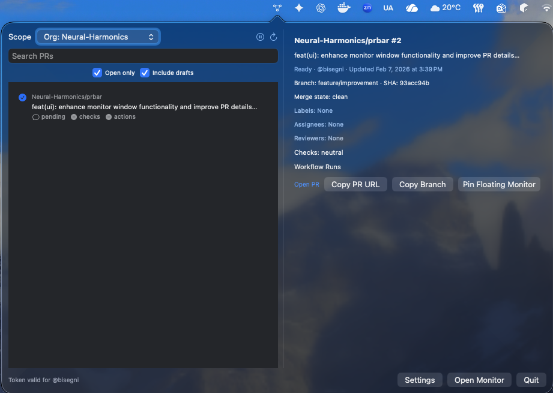
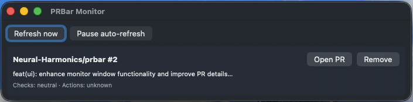

# PRBar

PRBar is a macOS menubar app for tracking your GitHub Pull Requests, checks, and GitHub Actions without keeping a browser tab open.

## Preview

### Main View

### Monitor View

- Platform: macOS 13+
- UI: Menubar popover + optional floating monitor window
- Data source: GitHub REST API
- Auth: GitHub Personal Access Token (stored in macOS Keychain)

---

## Table of Contents

1. [What PRBar Does](#what-prbar-does)
2. [Install PRBar](#install-prbar)
3. [First-Time Setup](#first-time-setup)
4. [UI Guides](#ui-guides)
5. [Preferences and Filters](#preferences-and-filters)
6. [Releases and Update Flow](#releases-and-update-flow)
7. [Security and Privacy](#security-and-privacy)
8. [Troubleshooting](#troubleshooting)
9. [FAQ](#faq)
10. [For Developers](#for-developers)

---

## What PRBar Does

PRBar helps you quickly inspect PR health from your menubar:

- List your PRs (search + scope filters)
- Click a PR to see details in the popover:
  - repo, PR number, title, draft/ready
  - updated time, branch, commit SHA
  - review/check summary
  - latest workflow runs, jobs, and step states
- Open links directly to PR/run pages in GitHub
- Copy PR URL and branch name quickly
- Pin one or more PRs into a floating always-on-top monitor window
- Auto-refresh data on a fixed interval with basic rate-limit awareness

---

## Install PRBar

### Option A (recommended): DMG

1. Open the latest release.
2. Download `PRBar-X.Y.Z.dmg`.
3. Open the DMG and drag `PRBar.app` to `/Applications`.
4. Launch `PRBar` from Applications.

### Option B: ZIP

1. Download `PRBar.app.zip`.
2. Unzip it.
3. Move `PRBar.app` to `/Applications`.
4. Launch `PRBar`.

### First launch and Gatekeeper

If a build is unsigned/unnnotarized, macOS may block first launch:

- Right-click `PRBar.app` -> `Open` -> confirm.
- Or System Settings -> Privacy & Security -> allow opening anyway.

Signed/notarized releases should open normally.

---

## First-Time Setup

### 1. Open Settings

- Click PRBar menubar icon.
- Click `Settings`.

### 2. Add your GitHub token

- Paste a GitHub PAT into `GitHub Token`.
- Click `Save + Validate`.

PRBar shows token validation status inline.

### 3. Recommended PAT permissions

#### Classic PAT (simple)

- `repo`
- `read:org`
- `workflow`

#### Fine-grained PAT

Read access for:

- Pull Requests
- Actions
- Checks
- Repository metadata in repos you want to monitor
- Organization metadata if using org filters

---

## UI Guides

PRBar includes two user-facing views. Start with these guides:

- [Main View Guide](docs/main-view.md)
- [Monitor View Guide](docs/monitor.md)

## Menubar Popover

Click PRBar in your menu bar to open the popover (main view). For a full walkthrough with screenshot, see [Main View Guide](docs/main-view.md).

## Floating Monitor

Use `Pin Floating Monitor` in the main view to open and populate the monitor window. For setup and usage details with screenshot, see [Monitor View Guide](docs/monitor.md).

---

## Preferences and Filters

Open Settings from popover.

## Refresh

- `Interval` controls refresh cadence (seconds)
- `Enable auto-refresh` toggles background refresh

## PR fetch behavior

- `PR limit`
- `Open only`
- `Include closed`
- `Include drafts`

## Scope

- Enable/disable Personal and Organizations
- Select specific orgs
- Optional repo allowlist tokens (`owner/repo`)
  - If allowlist is set, it overrides org scoping

## Status visibility

Settings also shows:

- token status
- API rate limit counters
- API call metrics by category

---

## Releases and Update Flow

Releases are created from tags in strict semantic format:

- `vMAJOR.MINOR.PATCH` (example: `v0.0.1`)

Each release publishes:

- `PRBar-X.Y.Z.dmg`
- `PRBar.app.zip`

CI/CD supports two modes:

- Mode A: unsigned packaging (no Apple signing secrets configured)
- Mode B: signed + notarized + stapled artifacts (best end-user UX)

---

## Security and Privacy

- GitHub token is stored only in macOS Keychain.
- Token is not written to UserDefaults or local cache files.
- Cached app data includes PR list/state/settings, but not credentials.
- Network calls are made to GitHub REST API over HTTPS.

---

## Troubleshooting

## “Missing token” after save

- Re-open Settings and retry `Save + Validate`.
- Ensure token is non-empty and valid.
- If error text is shown in red, use that message for diagnosis.

## No PRs appear

- Confirm token scopes/permissions.
- Check scope filters (Personal/Org/allowlist).
- Try disabling repo allowlist temporarily.
- Click manual refresh.

## Rate limits

If close to GitHub rate limit, PRBar slows refresh cadence.

- Check rate display in Settings.
- Increase interval.
- Narrow scope or lower PR limit.

## macOS blocked app launch

- Use right-click -> Open for first run if unsigned.
- Prefer signed/notarized release artifacts when available.

## Monitor window not updating

- Check if monitor auto-refresh is paused.
- Click `Refresh now`.
- Verify token validity and API status in Settings.

---

## FAQ

## Does PRBar support multiple GitHub accounts?

Not currently. One token at a time.

## Does PRBar edit or merge PRs?

No. It is read-focused monitoring and navigation.

## Can I use PRBar without org access?

Yes. Personal-only mode works.

## Can I inspect full workflow logs in-app?

PRBar focuses on summaries/job-step states and deep links to GitHub for full logs.

---

## For Developers

### Run locally

1. Open `PRBar.xcodeproj` in Xcode.
2. Select `PRBar` scheme.
3. Build and run on macOS.

### Release workflow

- Workflow file: `.github/workflows/release.yml`
- Packaging script: `scripts/package.sh`

Release trigger tag must be strict semver:

- `v0.0.1` (valid)
- `v.0.0.1` (invalid)

### Optional signing/notarization secrets

Set these in GitHub repository Actions secrets for signed Mode B:

- `MACOS_CERT_P12`
- `MACOS_CERT_PASSWORD`
- `MACOS_SIGNING_IDENTITY`
- `APPLE_TEAM_ID`
- `APPLE_ID`
- `APPLE_APP_SPECIFIC_PASSWORD`
